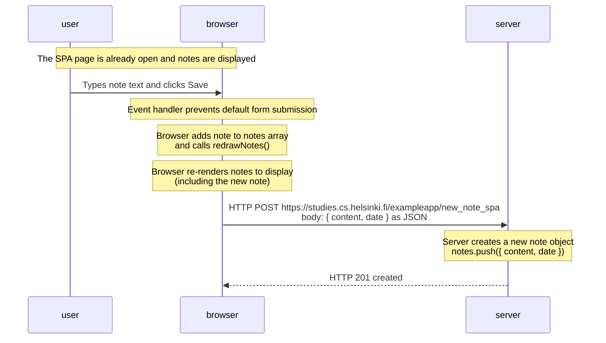

# New Note SPA

```mermaid
sequenceDiagram
    participant user
    participant browser
    participant server

    Note over user, browser: The SPA page is already open and notes are displayed

    user->>browser: Types note text and clicks Save

    Note over browser: Event handler prevents default form submission

    Note over browser: Browser adds note to notes array<br/>and calls redrawNotes()

    Note over browser: Browser re-renders notes to display<br/>(including the new note)

    browser->>server: HTTP POST https://studies.cs.helsinki.fi/exampleapp/new_note_spa<br/>body: { content, date } as JSON

    Note over server: Server creates a new note object<br/>notes.push({ content, date })

    server-->>browser: HTTP 201 created
```
