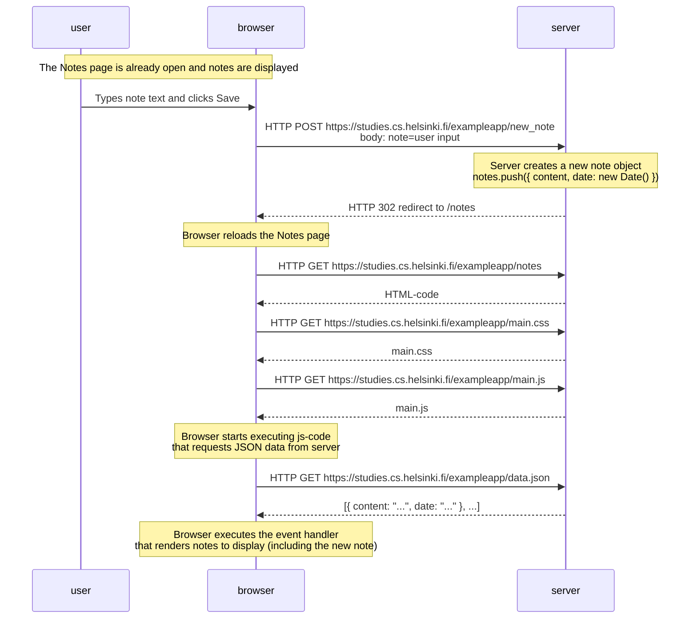

# New note diagram

```mermaid
sequenceDiagram
    participant user
    participant browser
    participant server

    Note over user, browser: The Notes page is already open and notes are displayed

    user->>browser: Types note text and clicks Save

    browser->>server: HTTP POST https://studies.cs.helsinki.fi/exampleapp/new_note<br/>body: note=user input

    Note over server: Server creates a new note object<br/>notes.push({ content, date: new Date() })

    server-->>browser: HTTP 302 redirect to /notes

    Note over browser: Browser reloads the Notes page

    browser->>server: HTTP GET https://studies.cs.helsinki.fi/exampleapp/notes
    server-->>browser: HTML-code

    browser->>server: HTTP GET https://studies.cs.helsinki.fi/exampleapp/main.css
    server-->>browser: main.css

    browser->>server: HTTP GET https://studies.cs.helsinki.fi/exampleapp/main.js
    server-->>browser: main.js

    Note over browser: Browser starts executing js-code<br/>that requests JSON data from server

    browser->>server: HTTP GET https://studies.cs.helsinki.fi/exampleapp/data.json
    server-->>browser: [{ content: "...", date: "..." }, ...]

    Note over browser: Browser executes the event handler<br/>that renders notes to display (including the new note)
```
