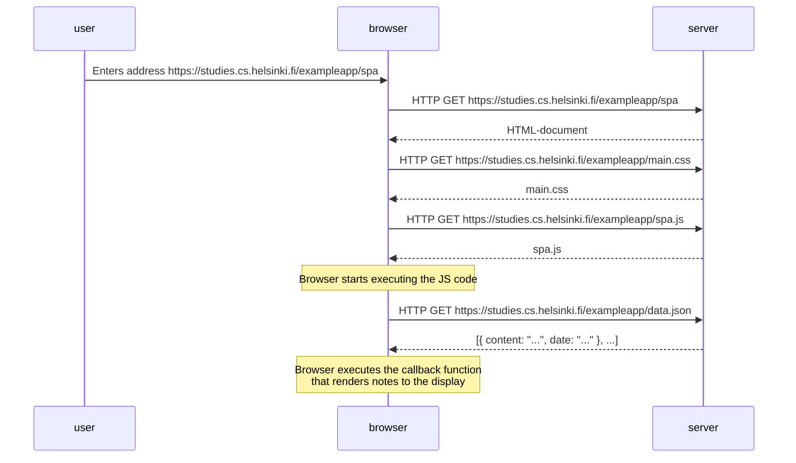

# Single page app

```mermaid
sequenceDiagram
    participant user
    participant browser
    participant server

    user->>browser: Enters address https://studies.cs.helsinki.fi/exampleapp/spa

    browser->>server: HTTP GET https://studies.cs.helsinki.fi/exampleapp/spa
    server-->>browser: HTML-document

    browser->>server: HTTP GET https://studies.cs.helsinki.fi/exampleapp/main.css
    server-->>browser: main.css

    browser->>server: HTTP GET https://studies.cs.helsinki.fi/exampleapp/spa.js
    server-->>browser: spa.js

    Note over browser: Browser starts executing the JS code

    browser->>server: HTTP GET https://studies.cs.helsinki.fi/exampleapp/data.json
    server-->>browser: [{ content: "...", date: "..." }, ...]

    Note over browser: Browser executes the callback function<br/>that renders notes to the display
```
